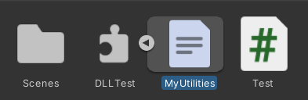

## Unity学习笔记

### 1. 脚本封装为链接库

Unity的C#脚本可以统一封装入一个链接库，通过引用（using）链接库的方式调用脚本中定义的类。可以在创建C#项目的时候选择项目类型为“类库”。


在创建的类库项目的引用中添加需要依赖的程序集。


之后在此项目（同名Namespace）中定义的程序，就会编译进一个与项目同名的链接库中，将链接库设置为Unity脚本项目的依赖库后，便可在Unity项目中导入使用该链接库中定义的程序。

```c#
// 链接库
using System;
using UnityEngine;

namespace DLLTest
{
	public class MyUtilities
	{
		public int c;

		public void AddValues(int a, int b)
		{
			c = a + b;
		}

		public static void GenerateRandom(int min, int max)
		{
			Debug.Log("GenerateRandom调用！！！");
		}
	}
}
```

```c#
// Unity脚本项目
using System.Collections;
using System.Collections.Generic;
using UnityEngine;
using DLLTest;		// 导入dll链接库

public class Test : MonoBehaviour
{
	void Start()
	{
		MyUtilities utils = new MyUtilities();		// 实例化链接库中定义的类
		utils.AddValues(2, 3);		// 调用链接库中定义的类的成员函数
		Debug.Log("2 + 3 = " + utils.c);		// 访问链接库中类的实例的publi成员
	}

	void Update()
	{
		MyUtilities.GenerateRandom(0, 100);		// 调用链接库中定义的类的静态成员函数
	}
}

```


除了导入C#脚本的链接库，还可以将C#链接库中包含的脚本类直接作为Script组件使用（**前提是链接库中供Unity使用的脚本类必须继承自MonoBehaviour**）：



```c#
// 可供Unity直接导入使用的DLL链接库
using System;
using UnityEngine;

namespace DLLTest
{
	public class MyUtilities : MonoBehaviour
	{
		void Start()
		{
			Debug.Log("只有继承MonoBehaviour的子类才能被Unity作为script组件！");
		}

		void Update()
		{
			Debug.Log("我爱Unity！");
		}
	}
}
```

