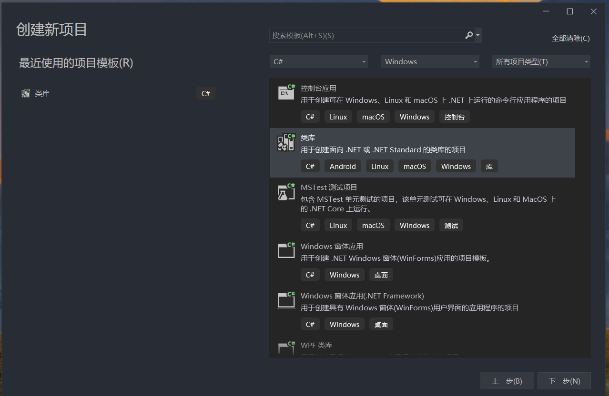
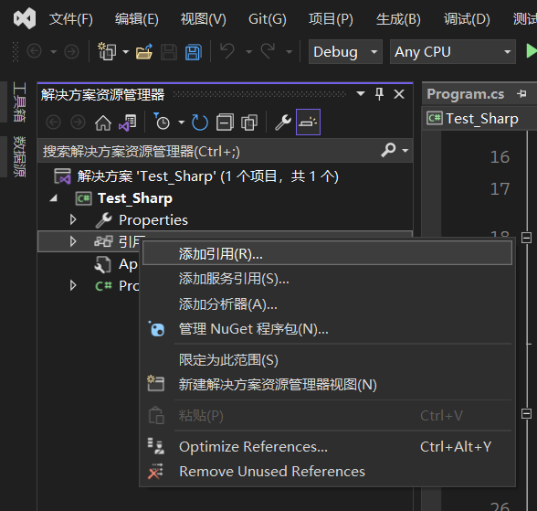
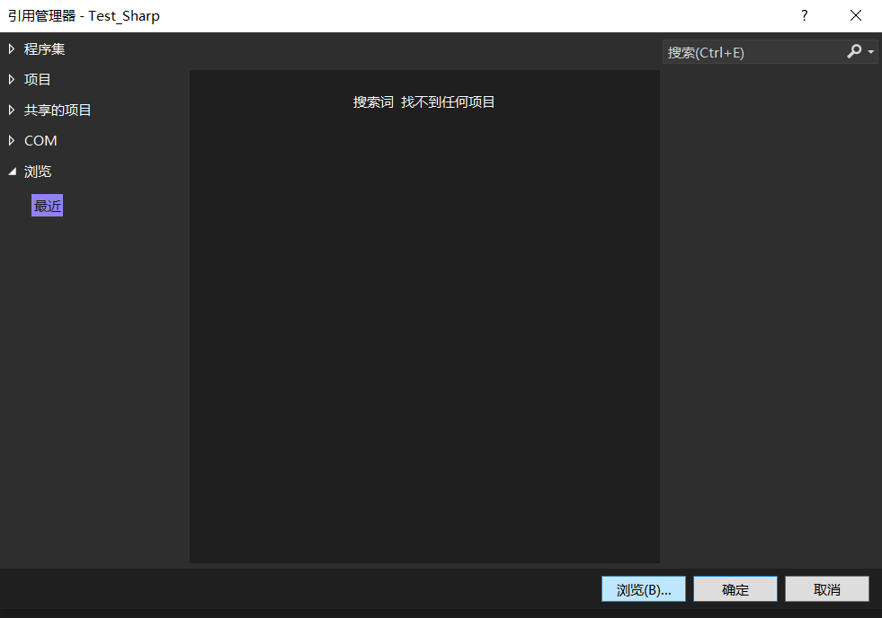
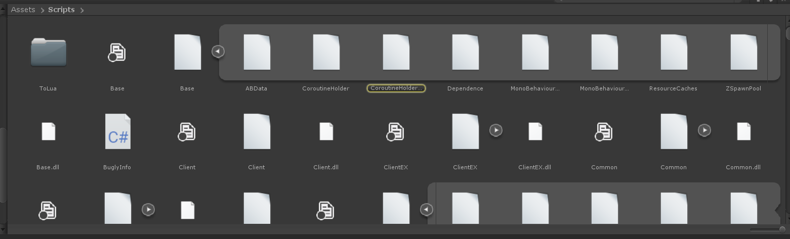
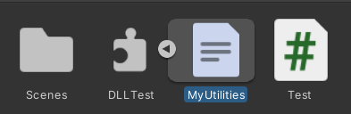
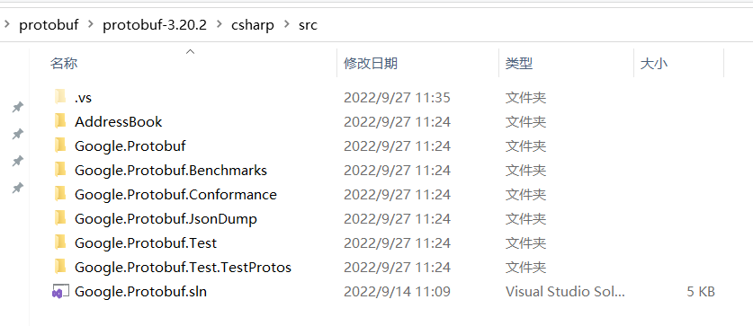
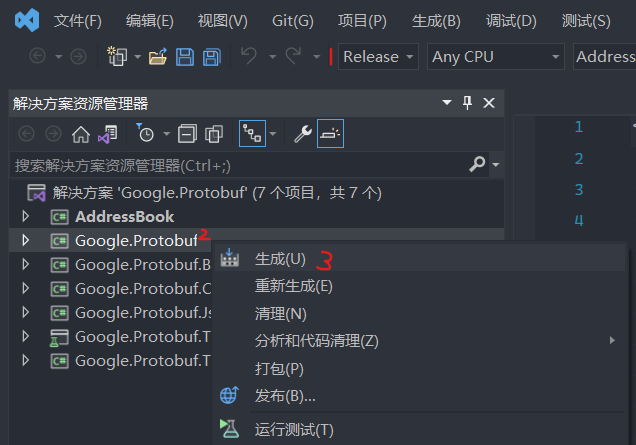
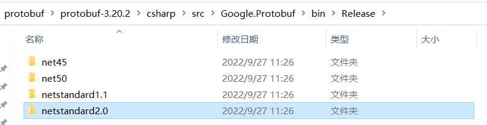
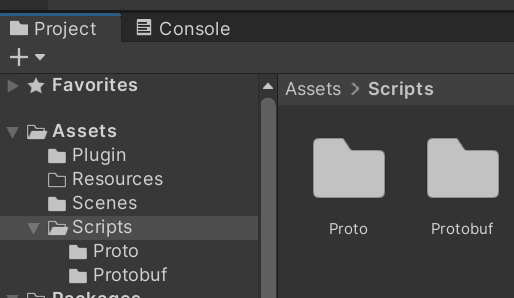
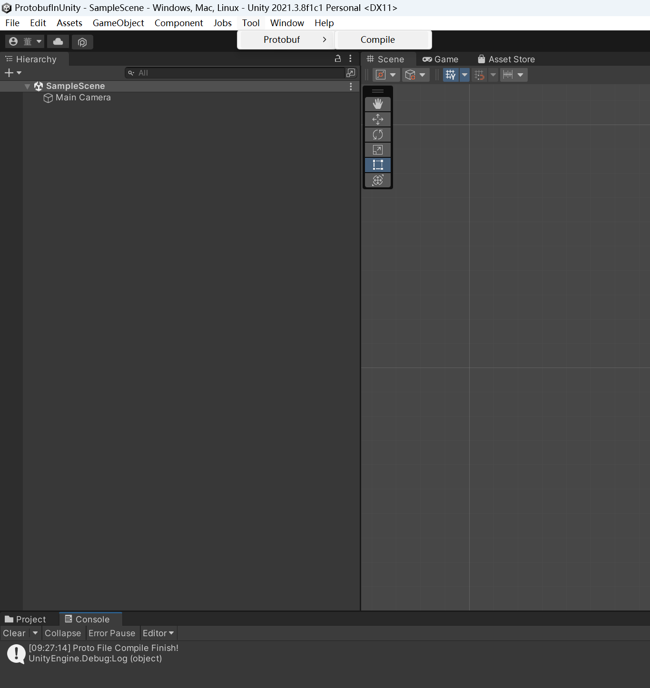

## Unity学习笔记

### 1. 脚本封装为链接库

Unity的C#脚本可以统一封装入一个链接库，通过引用（using）链接库的方式调用脚本中定义的类。可以在创建C#项目的时候选择项目类型为“类库”。



在创建的类库项目的引用中添加需要依赖的程序集。





之后在此项目（同名Namespace）中定义的程序，就会编译进一个与项目同名的链接库中，将链接库设置为Unity脚本项目的依赖库后，便可在Unity项目中导入使用该链接库中定义的程序。

```c#
// 链接库
using System;
using UnityEngine;

namespace DLLTest
{
	public class MyUtilities
	{
		public int c;

		public void AddValues(int a, int b)
		{
			c = a + b;
		}

		public static void GenerateRandom(int min, int max)
		{
			Debug.Log("GenerateRandom调用！！！");
		}
	}
}
```

```c#
// Unity脚本项目
using System.Collections;
using System.Collections.Generic;
using UnityEngine;
using DLLTest;		// 导入dll链接库

public class Test : MonoBehaviour
{
	void Start()
	{
		MyUtilities utils = new MyUtilities();		// 实例化链接库中定义的类
		utils.AddValues(2, 3);		// 调用链接库中定义的类的成员函数
		Debug.Log("2 + 3 = " + utils.c);		// 访问链接库中类的实例的publi成员
	}

	void Update()
	{
		MyUtilities.GenerateRandom(0, 100);		// 调用链接库中定义的类的静态成员函数
	}
}

```



除了导入C#脚本的链接库，还可以将C#链接库中包含的脚本类直接作为Script组件使用（**前提是链接库中供Unity使用的脚本类必须继承自MonoBehaviour**）：



```c#
// 可供Unity直接导入使用的DLL链接库
using System;
using UnityEngine;

namespace DLLTest
{
	public class MyUtilities : MonoBehaviour
	{
		void Start()
		{
			Debug.Log("只有继承MonoBehaviour的子类才能被Unity作为script组件！");
		}

		void Update()
		{
			Debug.Log("我爱Unity！");
		}
	}
}
```

### 2.多客户端测试

​	除了Build项目后，启动多个客户端程序去测试（测试岗一般方法），在自己本机上为了模拟多个客户端，可以通过Windows指令mklink创建项目文件夹的联接文件夹，类似于复制了一个会根据原项目文件夹变化的项目文件夹，这样就可以通过Unity同时打开两个名字不相同的项目，其中两个项目的核心文件都是会自动同步的。批处理程序如下：

```bat
@echo off

set dirSrc=E:\Rocket20220902\Bin\Client\Game\
set dirTarget=E:\Rocket20220902_Copy\Bin\Client\Game\

if not exist %dirSrc% ( md %dirSrc%)
if not exist %dirTarget% ( md %dirTarget%)

mklink /J %dirTarget%Assets %dirSrc%Assets

mklink /J %dirTarget%ProjectSettings %dirSrc%ProjectSettings

pause
```

### 3.Unity导入Protobuf

#### 下载protobuf库和编译工具

​	首先在GitHub上，下载最新版的Protobuf项目。

​	[Protobuf下载地址](https://github.com/protocolbuffers/protobuf/releases/tag/v3.20.2)


​	下载csharp语言的protobuf库的压缩包，并下载对应平台的protoc编译工具。

#### 项目导入protobuf



​	解压进入src目录，使用VS打开Google.Protobuf解决方案。



​	选择Release配置，生成Google.Protobuf程序集，编译成功后，生成的库文件在项目文件的bin\Release下。**PS：如果生成失败，请检查VS支持的.net sdk是否与下载的protobuf项目使用的一致。例如使用VS2022编译Protobuf3.19.2会报缺少.NET SDK的错误和警告，更换Protobuf3.20.1后就可以编译成功了。**

> NETSDK1141		Unable to resolve the .NET SDK version as specified in the global.json located at F:\protobuf\protobuf-3.19.2\global.json.
>
> 警告		无法找到 global.json 指定的 .NET SDK，请检查是否安装了指定的版本。

​	因为编译使用动态链接库需要保证Protobuf库、VS环境、Unity后台脚本编译器上的.net版本兼容，所以可以选择不使用Protobuf库，而是直接导入Protobuf源码的方式去使用Protobuf。

​	即只需要将下载的Protobuf项目中的csharp/src/Google.Protobuf文件夹复制粘贴到Unity项目的Asset目录中（具体路径可根据项目设计微调，但必须在Asset目录下）。

​	**PS：Protobuf 3.13以上版本，不可直接使用源码导入**

---



​	使用链接库方式导入：将**net45**文件夹下的库文件都复制粘贴到项目Assets目录下。**PS：Google.Protobuf库文件不在Unity项目Asset目录下会报找不到Google命名空间的错误。**

#### 根据proto文件生成cs脚本



​	创建Assets/Scripts/Protobuf文件夹，将.proto文件和protoc.exe放在Assets/Scripts/Proto文件夹中，使用Unity菜单栏工具（Tool/Protobuf/Compile）编译生成proto的cs脚本，cs脚本会自动生成在Assets/Scripts/Protobuf文件夹下。



### 4.Unity自动生成的配置文件

​	场景文件(.unity)：记录了所有场景中的GameObject上挂载的各个组件，以及各个组件的参数设置

​	资源配置(.meta)：记录了各种资源（预制体、美术资源、音频资源、文件夹资源、链接库资源）的参数设置

### 5.Unity中常用的宏定义

| 宏                     | 定义                          |
| :--------------------- | :---------------------------- |
| UNITY_STANDALONE       | PC(包括Windows、MacOS、Linux) |
| UNITY_STANDALONE_WIN   | Windows                       |
| UNITY_STANDALONE_OSX   | MacOS                         |
| UNITY_STANDALONE_LINUX | Linux                         |
| UNITY_ANDROID          | 安卓                          |
| UNITY_IOS              | IOS                           |
| UNITY_WEBGL            | WebGL                         |
| UNITY_WP_8_1           | Windows Phone 8.1             |
| UNITY_PS4              | PlayStation 4                 |

### 6.ReSharper For VS 常用快捷键

| 快捷键                        | 作用                                             |
| ----------------------------- | ------------------------------------------------ |
| Alt + F7                      | 查找引用                                         |
| Ctrl + N                      | Go To Everything 定位到任何，非常强大            |
| Ctrl + Shift + N              | Go To File 定位到文件                            |
| Ctrl + F12                    | Go To File Member 在当前类中查找                 |
| F2                            | 重命名任何东西，重构利器                         |
| Ctrl + Tab                    | 活动文件之间切换，当前打开的所有文件             |
| Ctrl + Shift + Alt +向上/向下 | 上下行代码交换位置                               |
| Ctrl + [Shift] + W            | 快速选中[/取消选中]整个/一块单词                 |
| Ctrl + Alt + F                | Clean Code                                       |
| Ctrl + Alt + J                | 快速添加语句块，如if,for,try catch,using,#region |
| Alt + F12                     | 显示下一个Error                                  |
| Ctrl + E                      | 显示最近编辑的文件                               |

